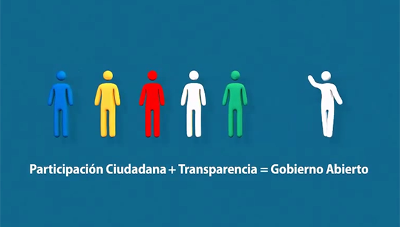
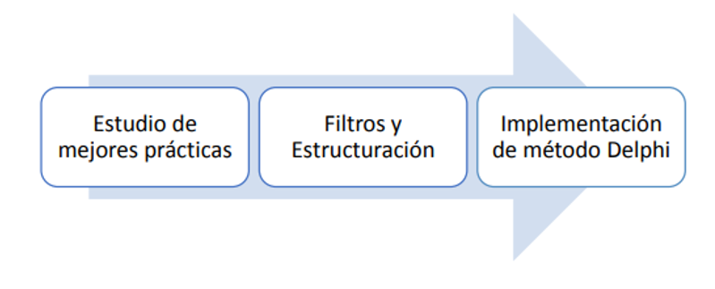
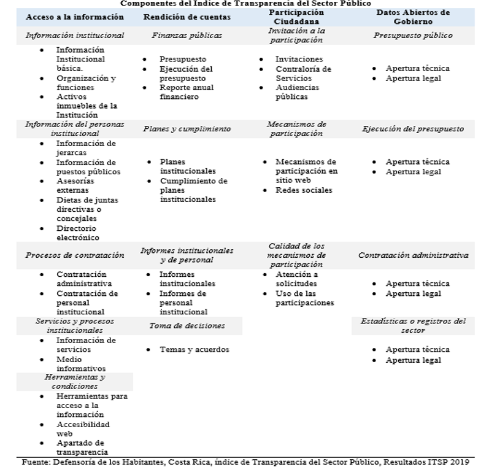
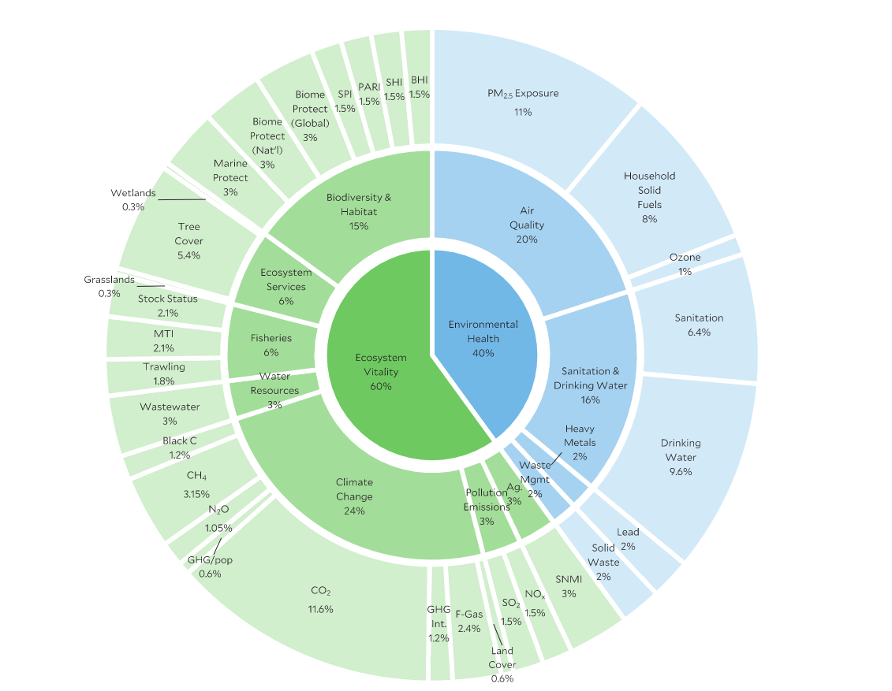
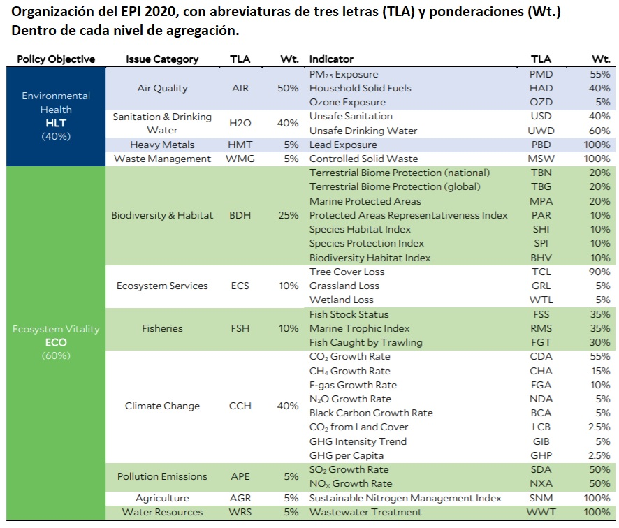
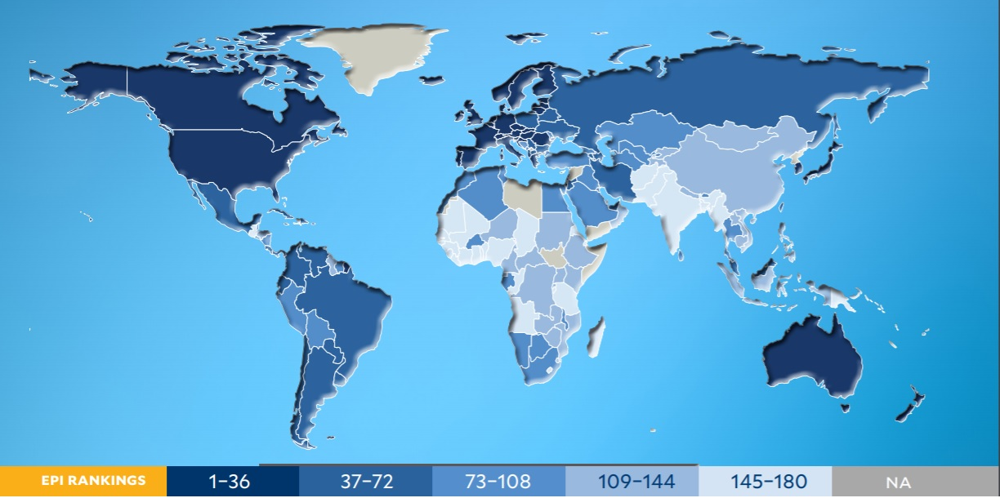
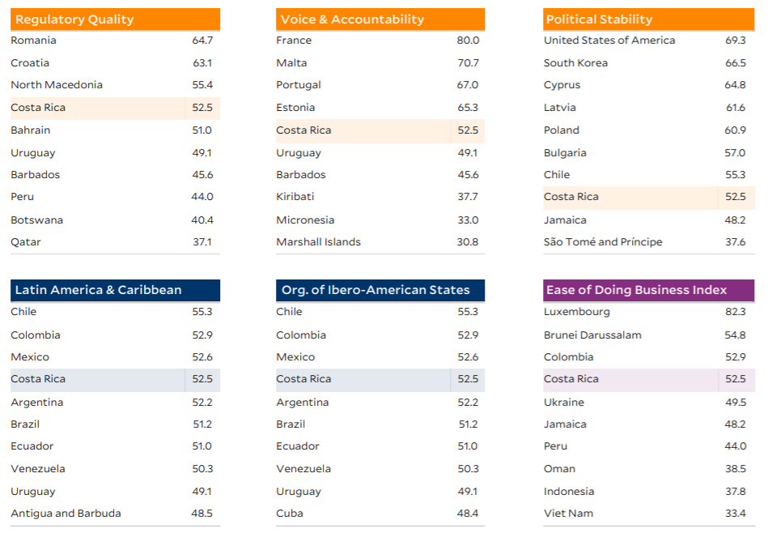

```{r setup, include=FALSE}


library(readxl)
library(ggplot2)
library(plotly)
library(devtools)
library(RColorBrewer)
library(tidyverse)
options(htmltools.dir.version = FALSE)
#devtools::install_github("yihui/xaringan")
#devtools::install_github("ropenscilabs/icon")

```

class: inverse,center, middle

#Índice Nacional:<br/>Índice de Transparencia del Sector Público.center3[
```{r, echo=FALSE}


icon::fa("share-alt-square", size = 4, animate = "still", fixed_width = TRUE)

```

]


---

<style>
  
  .center1 {
    margin: 0;
    position: absolute;
    top: 6%;
    right:15%;
    -ms-transform: translate(-50%, -50%);
    transform: translate(-50%, -50%);
  }
</style>


#<font size="5"> <b> Índice de Transparencia del Sector Público </b></font><br/>.center1[
```{r, echo=FALSE}
icon::fa("folder-open", size = 1, animate = "still", fixed_width = TRUE)

```
]


<font size="5">Es un instrumento de evaluación de la Defensoría de los Habitantes de la República elaborado por:</font><br/><br/>


 - <font size="5">Centro de Investigación y Capacitación en Administración Pública de la Universidad de Costa Rica (CICAP)</font><br/><br/>

 - <font size="5">Gobierno Digital


```{r echo=FALSE, eval=TRUE, out.width = "500px", out.height="250px", fig.align='center'}



```

---

#<font size="5"> <b>Marco teórico </b></font>.center1[
```{r, echo=FALSE}
icon::fa("file-signature", size = 1, animate = "still", fixed_width = TRUE)

```
]

 -	<font size="5">Defensoría de los habitantes</font><br/><br/>
 
 
 -	<font size="5">Supervisar el funcionamiento de la administración</font> <br/><br/>
 
 
 -	<font size="5">ITSP para fortalecer la apertura de las instituciones para con los ciudadanos</font>

```{r echo=FALSE, eval=TRUE, out.width = "500px", out.height="250px", fig.align='center'}


```

---

#<font size="5"> <b>Marco metodológico</b></font>.center1[
```{r, echo=FALSE}
icon::fa("chalkboard", size = 1, animate = "still", fixed_width = TRUE)

```
]


```{r echo=FALSE, eval=TRUE, out.width = "600px", out.height="410px", fig.align='center'}


```

<center><font size="2"> <b><i>Fuente: Defensoría de los habitantes, índice de Transparencia del sector Público. Resultados ITSP 2019 </i></b></font></center>

---

#<font size="5"> <b>Marco metodológico</b></font>.center1[
```{r, echo=FALSE}
icon::fa("chalkboard", size = 1, animate = "still", fixed_width = TRUE)

```
]


```{r echo=FALSE, eval=TRUE, out.width = "600px", out.height="510px", fig.align='center'}


```


---

#<font size="5"> <b>Marco metodológico</b></font>.center1[
```{r, echo=FALSE}
icon::fa("chalkboard", size = 1, animate = "still", fixed_width = TRUE)

```
]<br/><br/>

<style>

.center2 {
  margin:0;
  position: absolute;
  top: 50%;
  left: 50%;
  width=10px
  -ms-transform: translate(-40%, -40%);
  transform: translate(-50%, -50%);
}

</style>

.center2[
```{r echo=FALSE, eval=TRUE, out.width = "600px", out.height="300px", fig.align='center'}


```
]


---

#<font size="5"> <b>Gráfico de tendencia</b></font>.center1[
```{r, echo=FALSE}
icon::fa("chart-line", size = 1, animate = "still", fixed_width = TRUE)

```
]

<center><font size="3"> <b><i>Índice de Transparencia del Sector Público 2015-2019 </i></b></font></center>

```{r, fig.height=6, fig.width=11.5, echo=FALSE}
load("base_ind_Nac.Rdata")
base$institucion =base$`Nombre de la institución`

cls = c(brewer.pal(4,"Set2"),  brewer.pal(5, "Paired"), brewer.pal(3 ,"Set1"))

p=ggplot(base, aes(anio,ITSP, color = institucion,group= 1,  text= paste0("Año: ", anio,"\n", "ITSP: ", ITSP,"\n","Institución: ", institucion)
)) + 
    geom_line(show.legend = F)+
  geom_point()+
    theme_bw()+
   #ggtitle("Índice de Transparencia del Sector Público\n2015-2019")+
    xlab("Año")+
   theme(
plot.title = element_text(size=13, face="bold.italic",hjust=0.5) )+
scale_color_manual("Institución",values=cls)

  
ggplotly(p, tooltip = c("text")) %>%layout(annotations = 
 list(x =1.4, y = -0.3, text = '<b><i>Fuente:Defensoría de los habitantes,\n índice de Transparencia del sector Público.\nResultados ITSP 2019 </i></b>', 
      showarrow = F, xref='paper', yref='paper', 
      xanchor='auto', yanchor='left', xshift=0, yshift=0,
      font=list(size=9, color="black")), legend= list(font = list(size=11), 
      height = 900, width = 900))
```

<center><font size="2"> <b><i>Fuente: Defensoría de los habitantes, índice de Transparencia del sector Público. Resultados ITSP 2019 </i></b></font></center>


---

#<font size="5"> <b>Aspectos importantes</b></font>.center1[
```{r, echo=FALSE}
icon::fa("lightbulb", size = 1, animate = "still", fixed_width = TRUE)

```
]

.pull-left[
- De un total de 254 instituciones públicas, solo 105 tienen datos del índice desde 2015 hasta el 2019

Se tienen desagregaciones por 

- Naturaleza Jurídica (promedio) :
 - Poder Judicial
 - Ministerios
 - Poder Legislativo
]

.pull-right[
- Provincia(promedio,datos del 2018) 
 - Heredia la mejor 32 pts 
 - Limón la peor 5 pts 

</b>
- Red Interinstitucional de Transparencia 
 - Índice de tranparencia
 - Acceso  a información
 - Rendición de cuentas
 - Participación ciudadana
 - Datos abiertos de gobierno 
]
---

class: inverse,center, middle

#Índice Internacional:<br/> Índice de Desempeño Ambiental.center3[
```{r, echo=FALSE}
icon::fa("pagelines", size = 4, animate = "still")

```
]


---

#<font size="5"> <b> Índice de Desarrollo Ambiental (EPI) </b></font><br/>.center1[
```{r, echo=FALSE}
icon::fa("leaf", size = 1, animate = "still", fixed_width = TRUE)

```
]


-  <font size="4">El Índice de Desempeño Ambiental (EPI por sus siglas en inglés: Environmental Performance Index), es desarrollado por el Centro de Política y Ley Ambiental de la Universidad de Yale, en conjunto con la Red de Información del Centro Internacional de Ciencias de la Tierra de la Universidad de Columbia.</font><br/>

-  <font size="4">Utilizando 32 indicadores de desempeño en 11 categorías de problemas, el EPI clasifica a 180 países en salud ambiental y vitalidad del ecosistema.</font><br/>
 
-   <font size="4">La salud ambiental: mide la protección de la salud humana ante el impacto de los daños ambientales.</font><br/>

-   <font size="4">La vitalidad de los ecosistemas: mide la protección a los ecosistemas y la administración de recursos.</font><br/>

-  <font size="4">Las clasificaciones generales de EPI indican qué países están abordando mejor los desafíos ambientales que enfrenta cada nación.</font>


---

#<font size="5"> <b>Marco teórico </b></font>.center1[
```{r, echo=FALSE}
icon::fa("file-signature", size = 1, animate = "still", fixed_width = TRUE)

```
]
<center><font size="3"> <b><i>Marco Conceptual Índice de Desempeño Ambiental 2020 </i></b></font></center>
```{r echo=FALSE, eval=TRUE, out.width = "800px", out.height="520px", fig.align='center'}


```
<center><font size="2"> <b><i>Fuente: Yale Center for Environmental Law & Policy. (2020). Enviromental Performance Index: Global metrics for the environment  </i></b></font></center>


---

#<font size="5"> <b>Marco metodológico</b></font>.center1[
```{r, echo=FALSE}
icon::fa("chalkboard", size = 1, animate = "still", fixed_width = TRUE)

```
]

```{r echo=FALSE, eval=TRUE, out.width = "700px", out.height="520px", fig.align='center'}


```
<center><font size="2"> <b><i>Fuente: Yale Center for Environmental Law & Policy. (2020). Enviromental Performance Index: Global metrics for the environment  </i></b></font></center>


---

#<font size="5"> <b>Resultados</b></font>.center1[
```{r, echo=FALSE}
icon::fa("map-marked-alt", size = 1, animate = "still", fixed_width = TRUE)

```
]
<center><font size="4"> <b><i>Mapa Global: Indice de Desempeño Ambiental 2020  </i></b></font></center>
```{r echo=FALSE, eval=TRUE, out.width = "700px", out.height="520px", fig.align='center'}


```
<center><font size="2"> <b><i>Fuente: Yale Center for Environmental Law & Policy. (2020). Enviromental Performance Index: Global metrics for the environment  </i></b></font></center>

---

#<font size="5"> <b>Resultados</b></font>.center1[
```{r, echo=FALSE}
icon::fa("table", size = 1, animate = "still", fixed_width = TRUE)

```
]

<center><font size="4"> <b><i>Índice de Desempeño Ambiental 2020:  Resultados Ranking Mundial </i></b></font></center>
```{r eval=require('DT'), tidy=FALSE, echo=FALSE}


epi2020results <- read_excel("epi2020results.xlsx")

base_ind_Int=epi2020results %>% select(country,EPI.rnk.new, EPI.new) %>% rename(Ranking= EPI.rnk.new, Pais=country, Puntaje_Epi=EPI.new ) %>% arrange(Ranking)
DT::datatable(
  base_ind_Int,
  fillContainer = FALSE, options = list(pageLength = 5 , columnDefs = list(list(className = 'dt-center', targets="_all")))
)

```

<br/>
<center><font size="2"> <b><i>Fuente: Yale Center for Environmental Law & Policy. (2020). Enviromental Performance Index: Global metrics for the environment  </i></b></font></center>

---

#<font size="5"> <b>Calificación y posición de Costa Rica en el EPI 2020 </b></font>.center1[
```{r, echo=FALSE}
icon::fa("flag", size = 1, animate = "still", fixed_width = TRUE)

```
]


<center><font size="4"> <b><i>Índice de Desempeño Ambiental: Top 10 Países en Ranking Latinoamerica y El Caribe </i></b></font></center>


```{r eval=require('DT'), tidy=FALSE, echo=FALSE}

load("base_ind_CR.Rdata")

DT::datatable(
  base_ind_CR,
   fillContainer = FALSE, options = list(pageLength = 5 , columnDefs = list(list(className = 'dt-center', targets="_all")))
)
```

<br/>
<center><font size="2"> <b><i>Fuente: Yale Center for Environmental Law & Policy. (2020). Enviromental Performance Index: Global metrics for the environment  </i></b></font></center>

---


#<font size="5"> <b>Caracterización de Costa Rica en puntuaciones EPI</b></font>.center1[
```{r, echo=FALSE}
icon::fa("flag", size = 1, animate = "still", fixed_width = TRUE)

```
]

```{r echo=FALSE, eval=TRUE, out.width = "700px", out.height="520px", fig.align='center'}


```

Para consultar el informe completo de Costa Rica visitar [Yale](https://epi.yale.edu/sites/default/files/files/CRI_EPI2020_CP.pdf)


---

class: inverse

#<font size="5"> <b>Referencias Bibliográficas</b></font>.center1[
```{r, echo=FALSE}
icon::fa("book", size = 1, animate = "still", fixed_width = TRUE)

```
]

<br/>
<font size = "3", color = "white">
- <font size = "3", color = "white"> Centro de Investigación y Capacitación en Administración Pública. (2018). Índice de Transparencia del Sector Público Costarricense. Universidad de Costa Rica, San José, Costa Rica. Recuperado de: http://www.cicap.ucr.ac.cr/web/indice-transparencia/</font>
<br/><br/>
- <font size = "3", color = "white">Defensoría de los Habitantes. (2020). Índice de Transparencia del Sector Público. San José Costa Rica. Recuperado de: http://www.dhr.go.cr/red_de_transparencia/indice_de_transparencia_del_sector_publico.aspx </font>
<br/><br/>
- <font size = "3", color = "white">Huertas, G. & Sauma, P. (2015). Indicadores internacionales de desarrollo: seguimiento e interpretación para Costa Rica. Observatorio del Desarrollo, Universidad de Costa Rica, San José, Costa Rica. Recuperado de:
http://odd.ucr.ac.cr/sites/default/files/indicadores_internacionales_de_desarrollo/2015/application/pdf/serie_iid_04_epi.pdf </font>
<br/><br/>
- <font size = "3", color = "white">Wendling, Z., Emerson, J., Sherbinin, A. (2020). Índice de desempeño ambiental 2020. New Haven, CT: Yale Center for Environmental Law & Policy. Recuperado de: https://epi.yale.edu/</font>
<br/><br/>
- <font size = "3", color = "white">Zamora, D. (2015). Documento Metodológico: Índice de Transparencia del Sector Público Costarricense. San José, Costa Rica. Recuperado de:
http://www.dhr.go.cr/transparencia/compras_y_contrataciones/metodologia_itsp/Documento%20Metodologico%20ITSP.pdf </font>
<br/>


---
class: inverse, center, middle

#Muchas gracias <br/><br/><br/>


#¿Alguna pregunta?
